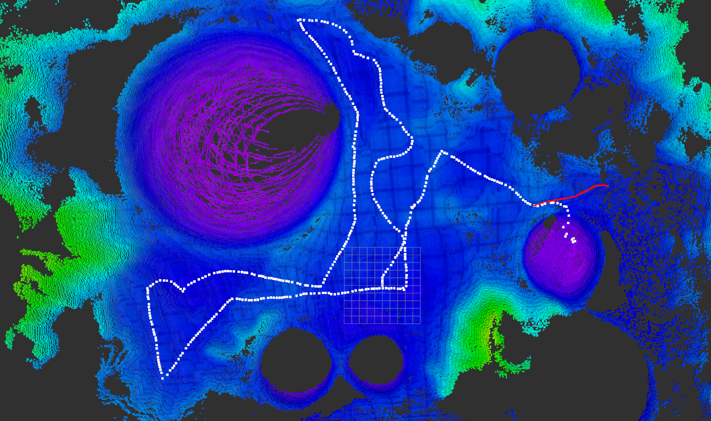
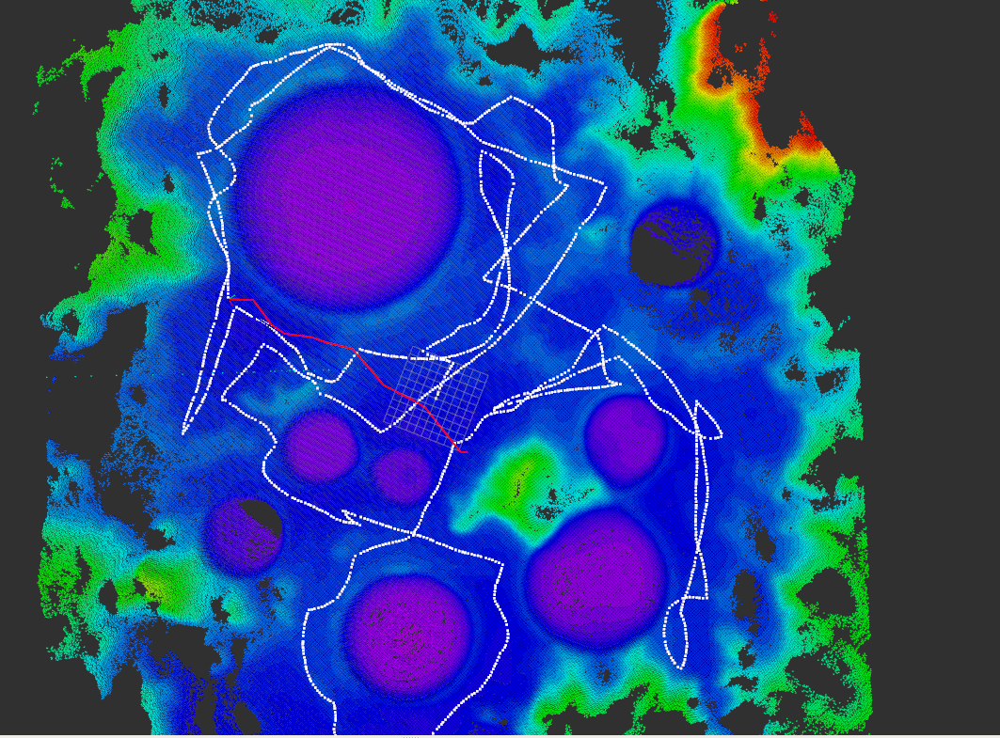
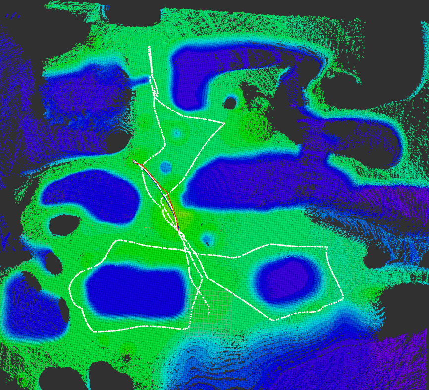
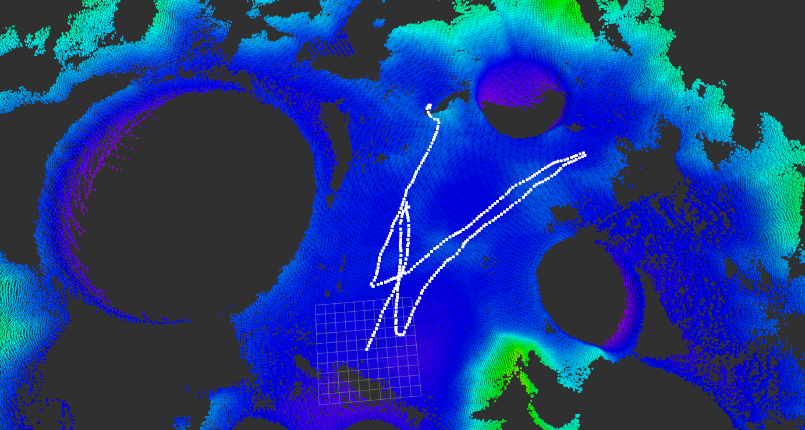

# 目录

[English version of readme](./readme_EN.md)

---

这里是制作数据集部分的实现代码

---

## data文件夹
下存放imu数据(txt文件)和点云数据(pcd文件)(来源于pc_data_make.cpp),按照ros时间戳命名(这个时间戳表示的是取局部点云时小车位置的时间，也就是局部点云中心位置的时间),相同时间戳的imu数据与点云数据表示对应关系

imu数据(txt文件)表示


```
时间戳　linear_acceleration.x　linear_acceleration.y linear_acceleration.z angular_velocity.x angular_velocity.y angular_velocity.z orientation.w orientation.x orientation.y orientation.z
```

## sh文件夹

存放了采集的仿真场景数据

aloam_data_moon_mountain.bag

aloam_data_2021-08-26-10-13-59.bag　　小范围下带有山的月面场景数据  



aloam_data_2021-08-26-09-42-27.bag 大范围下带有山的月面场景数据  



aloam_data_moon_flat.bag 大范围下平坦月面场景数据  




aloam_data_neg_data_flat.bag 平坦环境负样本

aloam_data_neg_data_flat_2.bag　平坦环境负样本

aloam_data_neg_data_mountain.bag 山地环境月面负样本数据　20210913

aloam_data_neg_data_mountain2.bag 山地环境月面负样本数据 20210913



## 如何制作数据集

### 步骤一: 录制原始数据(共有使用slam数据包与离线两种方式)
1. 使用slam数据包制作

该方式中，使用实时的slam系统构建点云地图，并对实时的点云地图进行采样; 可以用于采用真实场景中的数据以训练


播放采集数据
```
rosbag play xxx.bag
```

显示八叉树地图
```
roslaunch octomap_navi octomap_convert.launch slamType:=aloam
```

数据采集
```
roslaunch data_make pc_data_make.launch
```


2. 离线录制
加载预先生产的点云地图,无人车采用随机游走策略 (在地图上的重定位是通过读取gazebo中小车真值完成的,而非slam)
该模式下, 实时采集的是小车走过的轨迹上倒数第三个位置的数据，而不是实时采集小车此刻的位置，该做法是为了让imu数据可以更好的与点云数据对应

录制前注意事项:

- 修改`pc_data_make_offline.launch`文件:

```xml

  <node pkg="data_make" type="pc_data_make_offline" name="pc_data_make" output="screen">
    <param name="local_map_length" value= "2.0" />  <!-- size of 3D box when record data, 2*2*4 in paper 10*10*4 in prediction-->
    <param name="local_map_width" value="2.0" />
    <param name="local_map_height" value="4.0" />
    <param name="data_save_dir" value="/home/bornchow/ROS_WS/slam_ws/src/data_make/data/" />  <!-- where to save the data -->
    <param name="save_data" value="false" />  <!-- if record data, make sure to be set as true -->
    <param name="map_res" value="0.1" />
    <param name="sample_dis" value="0.5" />
    <param name="imu_time_window" value="1.5" />

    <param name="pc_topic" value="/cloud_pcd" />  <!-- global point cloud map topic -->
    <param name="imu_topic" value="/imu" /> <!-- imu topic -->
  </node>

```

- 修改`pc_to_octomap.launch`文件:

line 9 修改为全局点云地图的pcd文件
```xml
  <node pkg="pcl_ros" type="pcd_to_pointcloud" name="pcd_to_pointcloud" args="$(find data_make)/maps/mountain_moon_10.pcd 1 _frame_id:=$(arg mapFrame)" />

```

- 开始录制
```
data_make_offline.sh

```


录制之后: 数据将保存 data文件夹内 手动将其修改为`dataSet` / `dataTest`

---

### 步骤二: 对原始数据进行标注

```shell
python3 draw_imu_data.py  数据集路径(str)  是否显示图片(bool)
```
标注完成后将在数据集路径下生成标注文件 `std.md`

